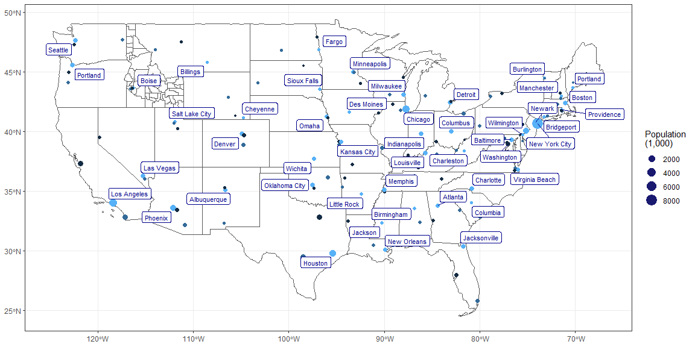

```r
# Use this R-Chunk to import all your datasets!
```

## Background

Up to this point, we have dealt with data that fits into the tidy format without much effort. Spatial data has many complicating factors that have made handling spatial data in R complicated. Big strides are being made to make spatial data tidy in R. However; we are in the middle of the transition.

We will use library(USAboundaries) and library(sf) to make a map of the US and show the top 3 largest cities in each state. Specifically, you will use library(ggplot2) and the function geom_sf() to recreate the provided image.

## Data Wrangling


```r
# Use this R-Chunk to clean & wrangle your data!
americas <- us_states() %>% 
  filter(!state_name %in% c("Hawaii", "Alaska", "Puerto Rico"))

idaho_counties <- us_counties(states = "Idaho")

topthree <- us.cities %>% 
  filter(!country.etc %in% c("HI", "AK")) %>% 
  group_by(country.etc) %>% 
  arrange(desc(pop),.by_group = TRUE) %>% 
  slice_head(n = 3) %>% 
  mutate(rank = rank(pop))

top_one <- us.cities %>% 
  filter(!country.etc %in% c("HI", "AK")) %>% 
  group_by(country.etc) %>% 
  arrange(desc(pop),.by_group = TRUE) %>% 
  slice_head(n = 1)


topthrees <- us_cities() %>% 
  filter(!state_name %in% c("Hawaii", "Alaska")) %>% 
  group_by(state_name) %>% 
  arrange(desc(population),.by_group = TRUE) %>% 
  slice_head(n = 3) %>% 
  mutate(rank = rank(population))


topones <- us_cities() %>% 
  filter(!state_name %in% c("Hawaii", "Alaska")) %>% 
  group_by(state_name) %>% 
  arrange(desc(population),.by_group = TRUE) %>% 
  slice_head(n = 1) %>% 
  mutate(rank = rank(population))

topones[, c('coords', 'coords1')] <- st_coordinates(topones$geometry)
```

## Data Visualization


```r
ggplot(data  = americas) + geom_sf(fill = NA) + geom_sf(data = idaho_counties, fill =NA) +
  geom_sf(data = topthrees, aes(col = rank, size = population/1000)) + theme_bw() +
  labs(size = "Population\n(1,000)", color = "dodgerblue4") +
  guides(color = "none", size = guide_legend(override.aes = list(color = "midnightblue"))) +
  theme(axis.title.x = element_blank(),
        axis.title.y = element_blank()) +
  geom_label_repel(data = topones,
                   aes(x = coords, y = coords1, label = city),
                   color = "blue4",
                   size = 3)
```

<!-- -->


## Conclusions
