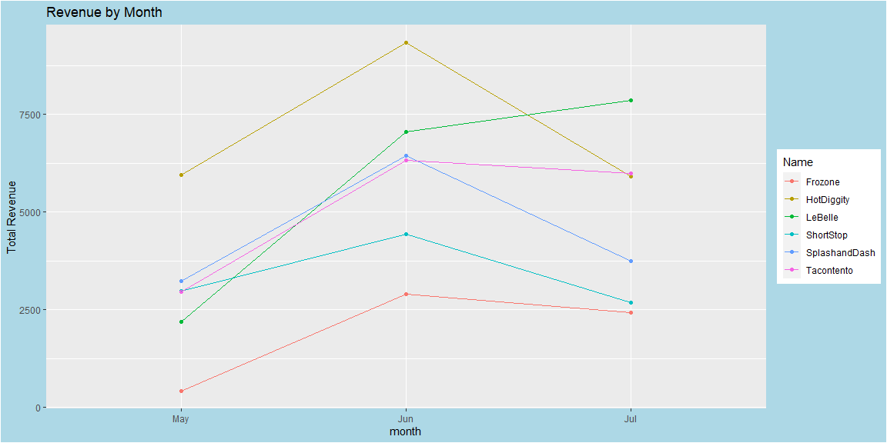
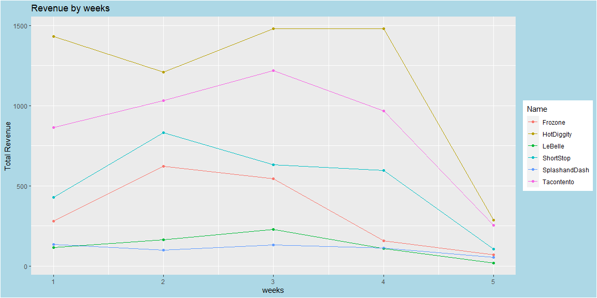
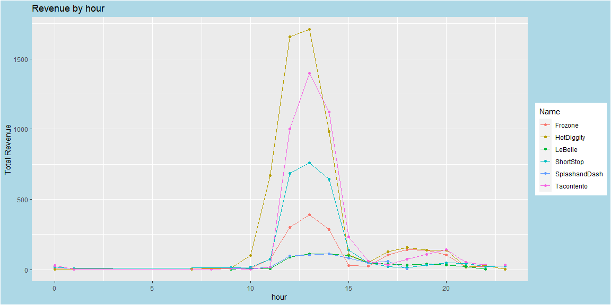
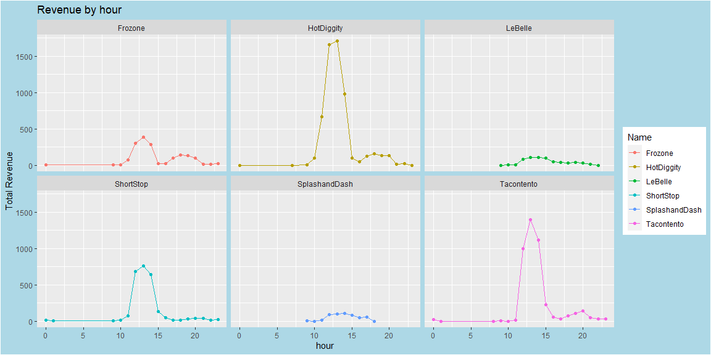

```r
# Use this R-Chunk to import all your datasets!
Sales <- read_csv("https://byuistats.github.io/M335/data/sales.csv") 
```

## Background
Help your boss understand which business is the best investment through visualizations.

Provide visualizations that show gross revenue over time for each company (aggregated at the daily, the weekly, and the monthly level).

Provide a visualization that gives insight into hours of operation for each company.

We don’t have employee numbers, but customer traffic (number of transactions) may be helpful. Provide a visualization on customer traffic for each company.

## Data Wrangling


```r
# Use this R-Chunk to clean & wrangle your data!
Sales <- read_csv("https://byuistats.github.io/M335/data/sales.csv") %>% 
  filter(Name != "Missing") %>% 
  mutate(Time = ceiling_date(with_tz(Time, tzone = "US/Mountain"), "hour")) %>% 
  mutate(hour = hour(Time)) %>% 
  mutate(day = day(Time)) %>%
  mutate(weeks = ceiling(day(Time)/7)) %>%
  mutate(month = month(Time, label = T))

sales <- Sales %>% 
  filter(month != "Apr")
```

## Data Visualization


```r
# Use this R-Chunk to plot & visualize your data!
totals <- sales %>% 
  group_by(Name,Type, month) %>% 
  summarize(Total = sum(Amount), Average = mean(Amount))


ggplot(totals, mapping = aes(x = month, y = Total, color = Name)) +
  geom_point() + geom_line(aes(group = Name)) +
  labs(title = "Revenue by Month",
       y = "Total Revenue") +
  theme(plot.background = element_rect(fill = 'lightblue'))
```

<!-- -->

```r
totw <- sales %>% 
  group_by(Name,Type, weeks) %>% 
  summarize(Total = n())

ggplot(totw, mapping = aes(x = weeks, y = Total, color = Name)) +
  geom_point() + 
  labs(title = "Revenue by weeks",  y = "Total Revenue") +
  geom_line(aes(group = Name)) +
  theme(plot.background = element_rect(fill = 'lightblue'))
```

<!-- -->

```r
toth <- sales %>% 
  group_by(Name,Type, hour) %>% 
  summarize(Total = n())

ggplot(toth, mapping = aes(x = hour, y = Total, color = Name)) +
  geom_point() + 
  labs(title = "Revenue by hour",
       y = "Total Revenue") +
  geom_line(aes(group = Name)) +
  theme(plot.background = element_rect(fill = 'lightblue'))
```

<!-- -->

```r
ggplot(toth, mapping = aes(x = hour, y = Total, color = Name)) +
  geom_point() + geom_line(aes(group = Name)) + 
  labs(title = "Revenue by hour",
       y = "Total Revenue") +
  facet_wrap(.~Name) +
  theme(plot.background = element_rect(fill = 'lightblue'))
```

<!-- -->

## Conclusions
HotDiggity looks appealing because they had higher revenues by the hour and weekly basis. However, the monthly trend does show LeBelle to be doing well for it did not experience a drop in their revenues. It has been rising.


