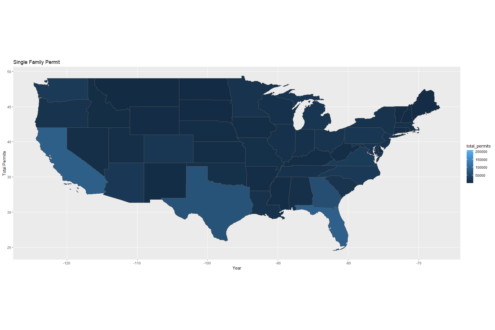
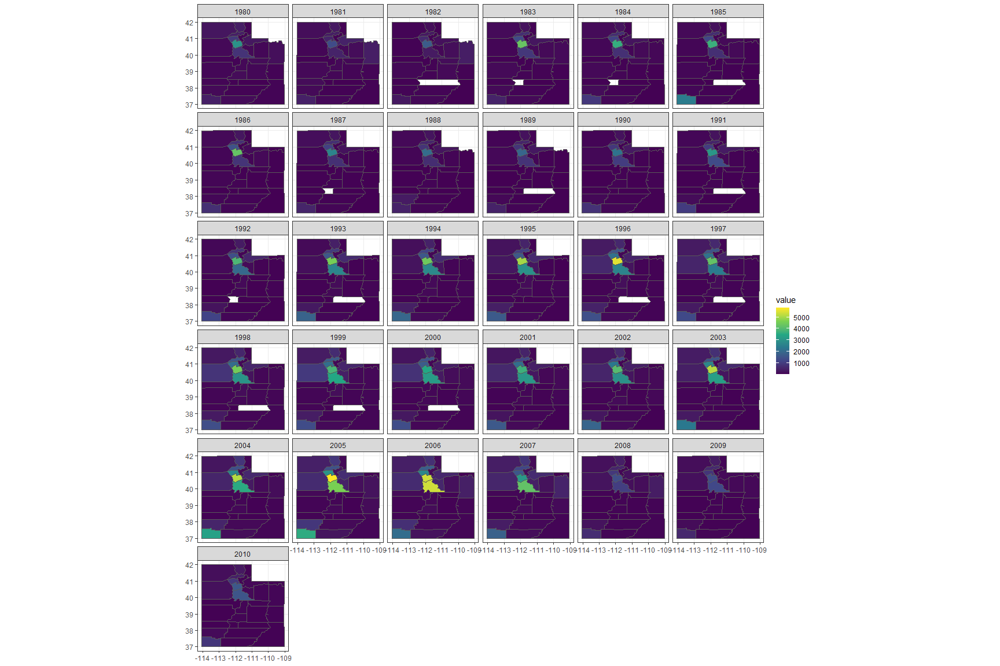
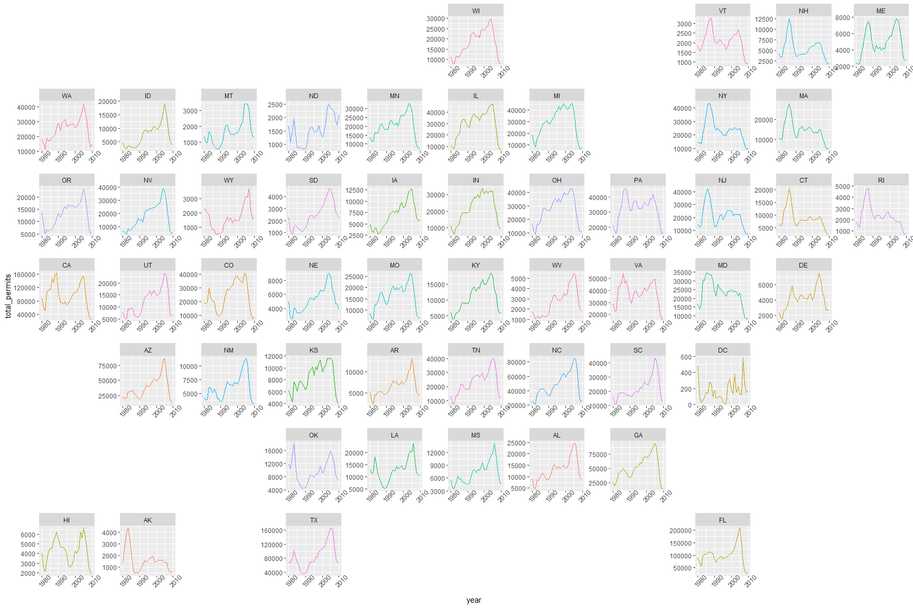
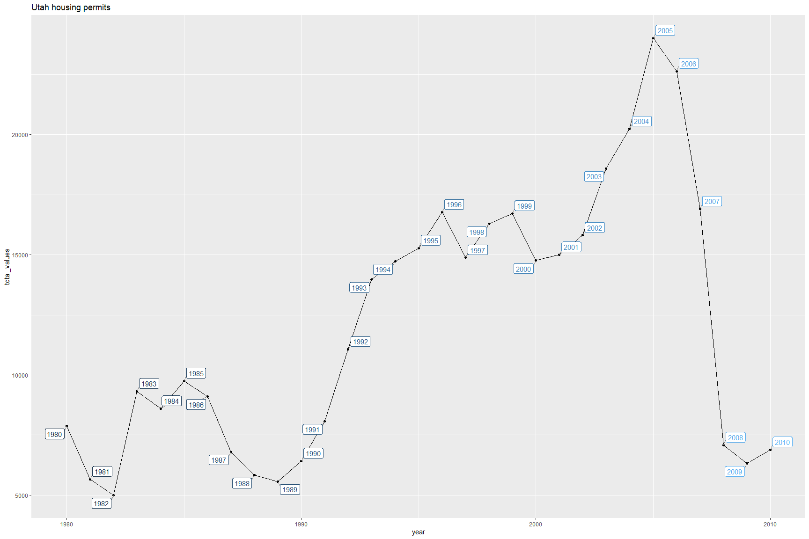

```r
# Use this R-Chunk to import all your datasets!
devtools::install_github("hathawayj/buildings")
```

```
## Error in get(genname, envir = envir) : object 'testthat_print' not found
```

```r
permits <- buildings :: permits
```

## Background


**You have been asked to support a story for a local news website that looks back on the [housing collapse of 2008](https://en.wikipedia.org/wiki/Subprime_mortgage_crisis) and the early effects on residential construction. You have data on residential building permits from 1980 through 2010 for each county in the United States. Your colleague that is writing the article would like a few maps and graphics that highlight the single family building permit patterns across your state as well as the patterns in the US.**


Use the library(USAboundaries) package to get the spatial maps for US states, and for the counties of the state you are focusing on

You will need to use the FIPS numbers (Links to an external site.) to merge with the permit data. Locate the appropriate columns, and convert them to numeric (to match the permit data)

Read in the permits data from devtools::install_github("hathawayj/buildings") and tidy it for spatial visualization needs

You will need to merge it with the spatial data, so find the FIPS column and make the type and name match the spatial data

Create state-level permit totals from the county level data

Create at least one chart that shows trends in single family building permits across the US over time

Create at least one chart that shows trends in single family building permits across counties in your state, over time

Create at least one additional chart that could be useful for the news article

Helpful:
[geofacet](https://hafen.github.io/geofacet/)


## Data Wrangling


```r
# Use this R-Chunk to clean & wrangle your data!
map_us <- us_states() %>% 
  filter(!state_name %in% c("Hawaii", "Alaska", "Puerto Rico"))

map_us <- map_us %>% 
  mutate(state =as.numeric(statefp))

map_utah <- us_counties(states = "Utah")

map_utah <- map_utah %>% 
  mutate(county = as.numeric(countyfp))

permits_utah <- permits %>% 
  filter(variable == "Single Family") %>% 
  filter(StateAbbr == "UT")

permits_total_utah <- permits_utah %>% 
  group_by(year) %>% 
  mutate(total_values = sum(value)) %>% 
  ungroup() %>% 
  distinct(year, total_values)


permits_us <- permits %>% 
  filter(variable == "Single Family") %>% 
  group_by(StateAbbr,year) %>% 
  mutate(total_permits = sum(value)) %>% 
  ungroup() %>% 
  distinct(state,StateAbbr, year, total_permits)

utah <- permits_utah %>% 
  left_join(map_utah)

us <- permits_us %>% 
  left_join(map_us)
```

## Data Visualization


```r
# Use this R-Chunk to plot & visualize your data!
ggplot(us) + geom_sf(aes(geometry = geometry, fill = total_permits))+
  labs(title = 'Single Family Permit', y = 'Total Permits', x = 'Year')
```

<!-- -->

```r
ggplot(utah) + geom_sf(aes(geometry = geometry, fill = value)) + 
  facet_wrap(vars(year))+
  scale_fill_viridis_c(option = "D")+
  theme_bw()
```

<!-- -->

```r
us %>% 
  ggplot(aes(x = year, y = total_permits,color = as.factor(state))) + geom_line() +
  facet_geo(~StateAbbr, scales = "free") +
  scale_color_discrete(guide = FALSE) +
  theme(axis.text.x = element_text(angle = 45))
```

<!-- -->

```r
ggplot(permits_total_utah , aes(x = year, y = total_values)) + geom_point() + geom_line() +
  guides(color = "none") +
  geom_label_repel(aes(label = year, color = year),
                   segment.color = 'grey50') +
  labs(title = "Utah housing permits")
```

<!-- -->

## Conclusions
The decline of housing permits in Utah began to happen after the year 2005

