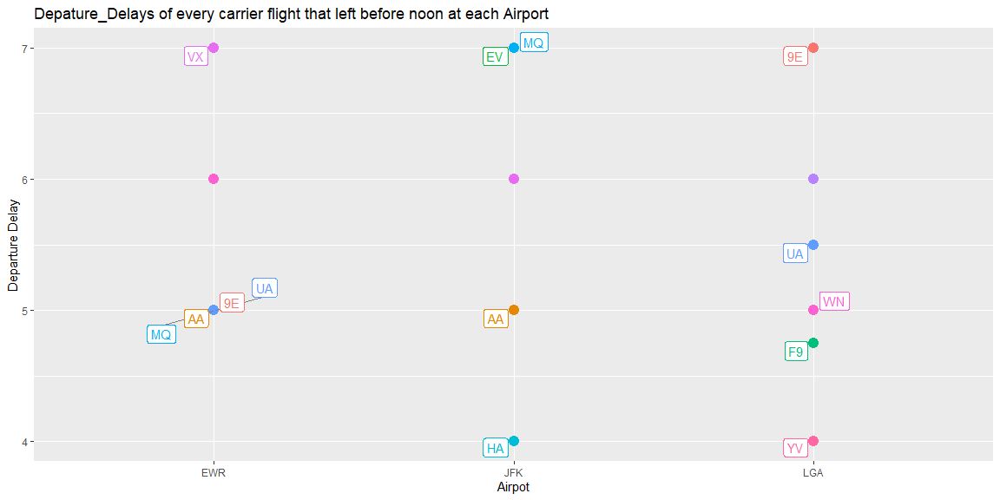
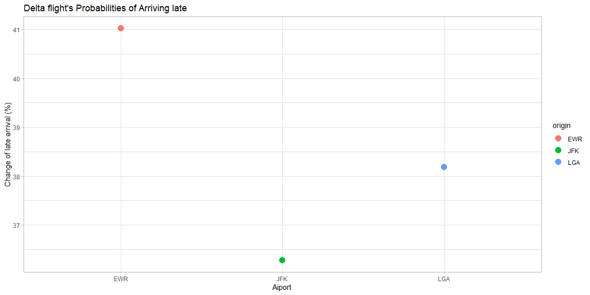

```r
# Use this R-Chunk to import all your datasets!
denge <- nycflights13::flights
```

## Background

You just started your internship at a big firm in New York, and your manager gave you an extensive file of flights that departed JFK, LGA, or EWR in 2013. From this data (nycflights13::flights), which you can obtain in R (install.packages("nycflights13"); library(nycflights13)), your manager wants you to answer the following questions;

If I am leaving before noon, which two airlines do you recommend at each airport (JFK, LGA, EWR) that will have the lowest delay time at the 75th percentile?
Which origin airport has the lowest probability of a late arrival when I am using Delta Airlines?
Which destination airport is the worst (you decide on the metric for worst) airport for arrival time

## Data Wrangling


```r
# Use this R-Chunk to clean & wrangle your data!
denge3 <- select(denge,"year","month","dep_time","carrier","dep_delay","arr_delay","origin", "dest")
denge4 <-filter(denge3, dep_time < 1200,dep_delay < 10 & dep_delay > 0, na.rm = TRUE) %>% 
  group_by(carrier, origin) %>% 
  summarise(percentile = quantile(dep_delay, 0.75))
```

## Data Visualization


```r
# Use this R-Chunk to plot & visualize your data!

ggplot(data = denge4, aes(x = origin, y = percentile)) +
  geom_point(aes(color = carrier), size = 4) +
  labs(x = "Airpot", y = "Departure Delay", title = "Depature_Delays of every carrier flight that left before noon at each Airport") +
  #geom_text(aes(label = carrier),hjust=2, vjust=0) 
  guides(color = "none") +
  geom_label_repel(aes(label = carrier, color = carrier),
                   #color = "slateblue",
                   #box.padding   = 0.35, 
                  # point.padding = 0.9,
                   segment.color = 'grey50')
```

<!-- -->


```r
delta <- denge3 %>% 
  filter(carrier == "DL", arr_delay > 0) %>% 
  group_by(origin) %>% 
  summarise(probability = sum(na.rm = TRUE,arr_delay/n()))

delta
```

```
## # A tibble: 3 x 2
##   origin probability
##   <chr>        <dbl>
## 1 EWR           41.0
## 2 JFK           36.3
## 3 LGA           38.2
```

```r
ggplot(delta, aes(x = origin, y = probability)) + geom_point(aes(color = origin), size = 4) +
  labs(x = "Aiport", y = "Change of late arrival (%)", title = "Delta flight's Probabilities of Arriving late") +
  theme_light()
```

<!-- -->


## Conclusions

### **Planning on leaving before noon!!**

At the EWR airport, the manger can choose from AA, 9E, UA or MQ

At the JFK airport, the manger can choose from either HA or AA

At the LGA airport, the manger can choose from either YV or F9


### **Lowest Probability of arriving late!!**

As for the lowest probability, JFK would be the best choice compared to the rest
