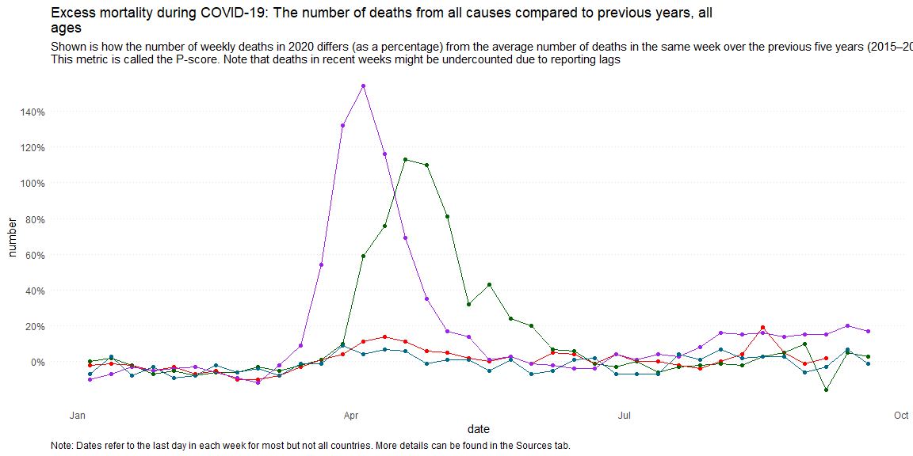
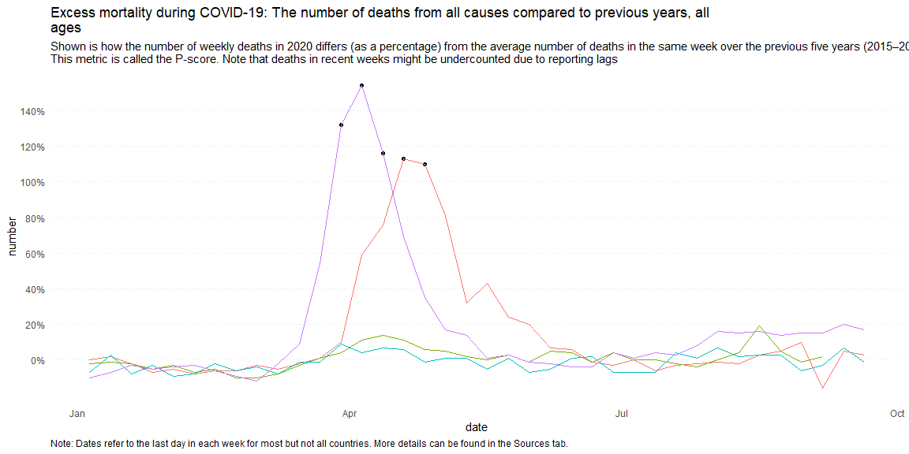
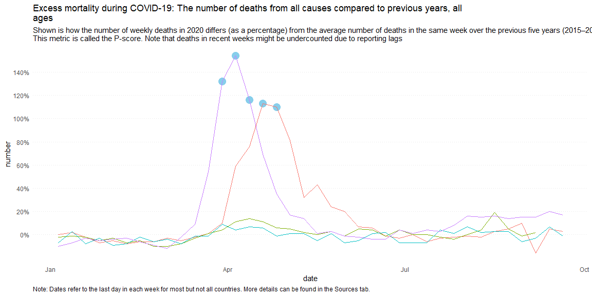
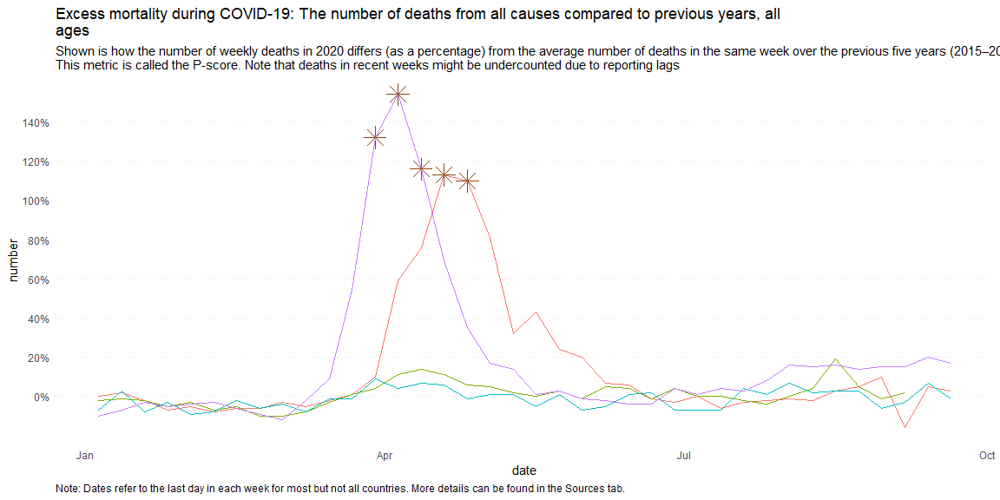
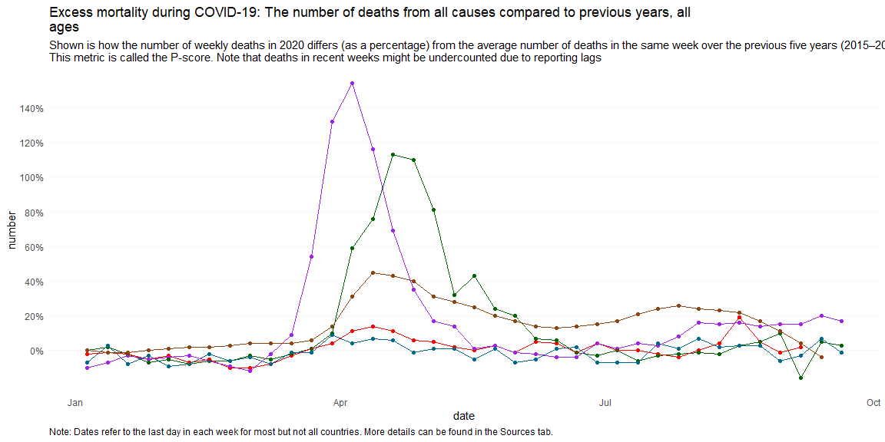
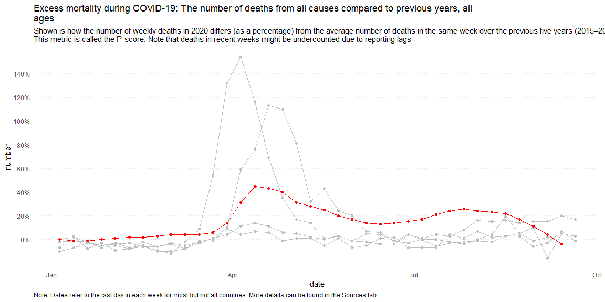
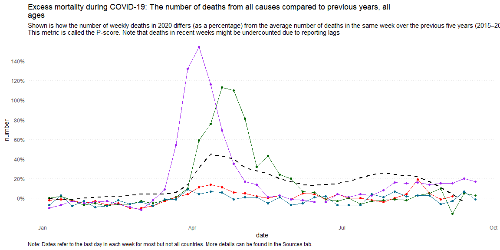

```r
# Use this R-Chunk to import all your datasets!
info <- read_csv("https://github.com/ktoutloud/classslides/raw/master/math335/data/covid19_p-scores.csv")
```

## Background
1 graph) Recreate this graph (Links to an external site.) as closely as you can. Focus on labels (title, subtitle, and caption), the y-axis, and line color.

[ ] Start with this data set read_csv("https://github.com/ktoutloud/classslides/raw/master/math335/data/covid19_p-scores.csv")

[ ] Spain's p-score was left as a decimal instead of a percentage like the other countries. Correct this error before creating the graph.

[ ] (3 graphs) Suppose we wanted to highlight any points that are above 100%. Create three more graphs that show three different ways to highlight these points.

[ ] Text labels should be used for at least one method.
 
[ ] (2 graphs) Now add a line for the United States and make two graphs showing two different methods to highlight the United States data.

## Data Wrangling


```r
# Use this R-Chunk to clean & wrangle your data!
b <- info %>% 
  select("date","Spain", "Germany","England & Wales", "Norway", "United States") %>% 
  mutate("Spain" = Spain * 100)


b1 <- b %>%  select("date","Germany") %>% 
  rename('number' = 'Germany')
b2 <- b %>%  select("date","Spain") %>% 
  rename('number' = 'Spain')
b3 <- b %>%  select("date","England & Wales") %>% 
  rename('number' = 'England & Wales')
b4 <- b %>%  select("date","Norway") %>% 
  rename('number' = 'Norway')
b5 <- b %>%  select("date","United States") %>% 
  rename('number' = 'United States')


b1$country <- "Germany" 
b2$country <- "Spain"
b3$country <- "England"
b4$country <- "Norway"
b5$country <- "United States"


data <- bind_rows(b1,b2,b3,b4) %>% 
  filter(date < "2020-09-27")


#us included
data.us <- bind_rows(b1,b2,b3,b4,b5) %>% 
  filter(date < "2020-09-27")
```

## Immitation
Still need to work on my axis


```r
# Use this R-Chunk to plot & visualize your data!

mortality <- ggplot(data,aes(x = date, y = number, color = country, group = country)) + 
  geom_point() + geom_line() +
  labs(title = "Excess mortality during COVID-19: The number of deaths from all causes compared to previous years, all
ages",
       subtitle = "Shown is how the number of weekly deaths in 2020 differs (as a percentage) from the average number of deaths in the same week over the previous five years (2015–2019).
This metric is called the P-score. Note that deaths in recent weeks might be undercounted due to reporting lags",
       caption = "Note: Dates refer to the last day in each week for most but not all countries. More details can be found in the Sources tab.") +
  scale_y_continuous(breaks=seq(0,140,20),
                     minor_breaks = NULL,
                     labels = function(x)paste0(x,"%")) +
  scale_color_manual(values = c("Germany" = "red", "Norway" = "deepskyblue4", "Spain" = "purple", "England" =  "darkgreen")) +
  theme_minimal() +           #from here going down its Klarson's code
  theme(legend.position = "none",
        panel.grid = element_blank(),
        panel.grid.major.y = element_line(colour = "grey90", linetype = "dotted"),
        plot.caption = element_text(hjust = 0))

mortality 
```

<!-- -->


## Over a hundred
one more, need to do the geom_label


```r
pa <- data %>% 
  ggplot(aes(x = date, y = number, color = country, group = country)) + 
  geom_point(data = filter(data, number>100), color = "black") + geom_line() +
  labs(title = "Excess mortality during COVID-19: The number of deaths from all causes compared to previous years, all
ages",
       subtitle = "Shown is how the number of weekly deaths in 2020 differs (as a percentage) from the average number of deaths in the same week over the previous five years (2015–2019).
This metric is called the P-score. Note that deaths in recent weeks might be undercounted due to reporting lags",
       caption = "Note: Dates refer to the last day in each week for most but not all countries. More details can be found in the Sources tab.") +
  scale_y_continuous(breaks=seq(0,140,20),
                     minor_breaks = NULL,
                     labels = function(x)paste0(x,"%"))+
  theme_minimal() +
  theme(legend.position = "none",
        panel.grid = element_blank(),
        panel.grid.major.y = element_line(colour = "grey90", linetype = "dotted"),
        plot.caption = element_text(hjust = 0))
pa  
```

<!-- -->

```r
pe <- data %>% 
  ggplot(aes(x = date, y = number, color = country, group = country)) + 
  geom_point(data = filter(data, number>100), color = "skyblue", size =5, shape = 16) + geom_line()+
  labs(title = "Excess mortality during COVID-19: The number of deaths from all causes compared to previous years, all
ages",
       subtitle = "Shown is how the number of weekly deaths in 2020 differs (as a percentage) from the average number of deaths in the same week over the previous five years (2015–2019).
This metric is called the P-score. Note that deaths in recent weeks might be undercounted due to reporting lags",
       caption = "Note: Dates refer to the last day in each week for most but not all countries. More details can be found in the Sources tab.") +
  scale_y_continuous(breaks=seq(0,140,20),
                     minor_breaks = NULL,
                     labels = function(x)paste0(x,"%")) +
  theme_minimal() +
  theme(legend.position = "none",
        panel.grid = element_blank(),
        panel.grid.major.y = element_line(colour = "grey90", linetype = "dotted"),
        plot.caption = element_text(hjust = 0))
pe
```

<!-- -->

```r
po <- data %>% 
  ggplot(aes(x = date, y = number, color = country, group = country)) + 
  geom_point(data = filter(data, number>100), color = "saddlebrown", size =6, shape = 8) + geom_line()+
  labs(title = "Excess mortality during COVID-19: The number of deaths from all causes compared to previous years, all
ages",
       subtitle = "Shown is how the number of weekly deaths in 2020 differs (as a percentage) from the average number of deaths in the same week over the previous five years (2015–2019).
This metric is called the P-score. Note that deaths in recent weeks might be undercounted due to reporting lags",
       caption = "Note: Dates refer to the last day in each week for most but not all countries. More details can be found in the Sources tab.") +
  scale_y_continuous(breaks=seq(0,140,20),
                     minor_breaks = NULL,
                     labels = function(x)paste0(x,"%")) +
  theme_minimal() +
  theme(legend.position = "none",
        panel.grid = element_blank(),
        panel.grid.major.y = element_line(colour = "grey90", linetype = "dotted"),
        plot.caption = element_text(hjust = 0))
po
```

<!-- -->


```r
mortality.us <- ggplot(data.us,aes(x = date, y = number, color = country, group = country)) + 
  geom_point() + geom_line() +
  labs(title = "Excess mortality during COVID-19: The number of deaths from all causes compared to previous years, all
ages",
       subtitle = "Shown is how the number of weekly deaths in 2020 differs (as a percentage) from the average number of deaths in the same week over the previous five years (2015–2019).
This metric is called the P-score. Note that deaths in recent weeks might be undercounted due to reporting lags",
       caption = "Note: Dates refer to the last day in each week for most but not all countries. More details can be found in the Sources tab.") +
  scale_y_continuous(breaks=seq(0,140,20),
                     minor_breaks = NULL,
                     labels = function(x)paste0(x,"%")) +
  scale_color_manual(values = c("Germany" = "red", "Norway" = "deepskyblue4", "Spain" = "purple", "England" =  "darkgreen", "United States" = "saddlebrown"))+
  scale_size_manual(values = c("United States" = 5, "Germany" = 1, "Norway" = 1, "Spain" = 1, "England" = 1), guide = F) +
  theme_minimal() +
  theme(legend.position = "none",
        panel.grid = element_blank(),
        panel.grid.major.y = element_line(colour = "grey90", linetype = "dotted"),
        plot.caption = element_text(hjust = 0))
mortality.us
```

<!-- -->

```r
mortality.us1 <- ggplot(data.us,aes(x = date, y = number, color = country, group = country)) + 
  geom_point() + geom_line() +
  labs(title = "Excess mortality during COVID-19: The number of deaths from all causes compared to previous years, all
ages",
       subtitle = "Shown is how the number of weekly deaths in 2020 differs (as a percentage) from the average number of deaths in the same week over the previous five years (2015–2019).
This metric is called the P-score. Note that deaths in recent weeks might be undercounted due to reporting lags",
       caption = "Note: Dates refer to the last day in each week for most but not all countries. More details can be found in the Sources tab.") +
  scale_y_continuous(breaks=seq(0,140,20),
                     minor_breaks = NULL,
                     labels = function(x)paste0(x,"%")) +
  scale_color_manual(values = c("Germany" = "grey", "Norway" = "grey", "Spain" = "grey", "England" =  "grey", "United States" = "red")) +
  theme_minimal() +
  theme(legend.position = "none",
        panel.grid = element_blank(),
        panel.grid.major.y = element_line(colour = "grey90", linetype = "dotted"),
        plot.caption = element_text(hjust = 0))
mortality.us1
```

<!-- -->

```r
usonly <- data.us %>% filter(country == "United States")

mortality + 
  geom_line(data = usonly, size = 1, linetype = "dashed", color = "black")
```

<!-- -->


## Conclusions
