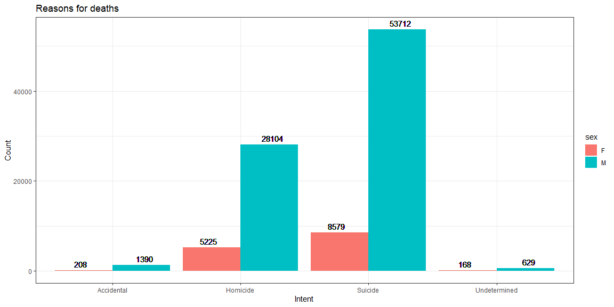
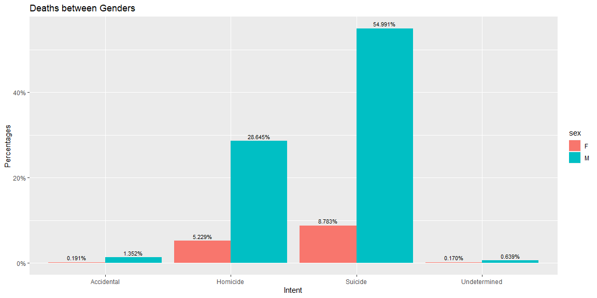
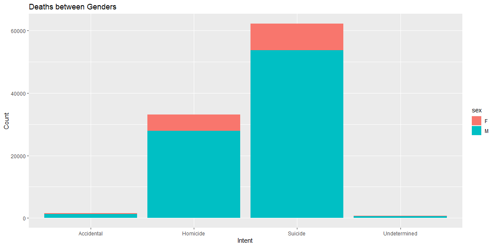
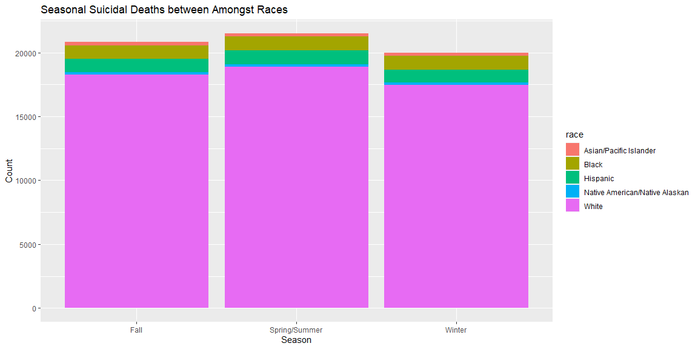
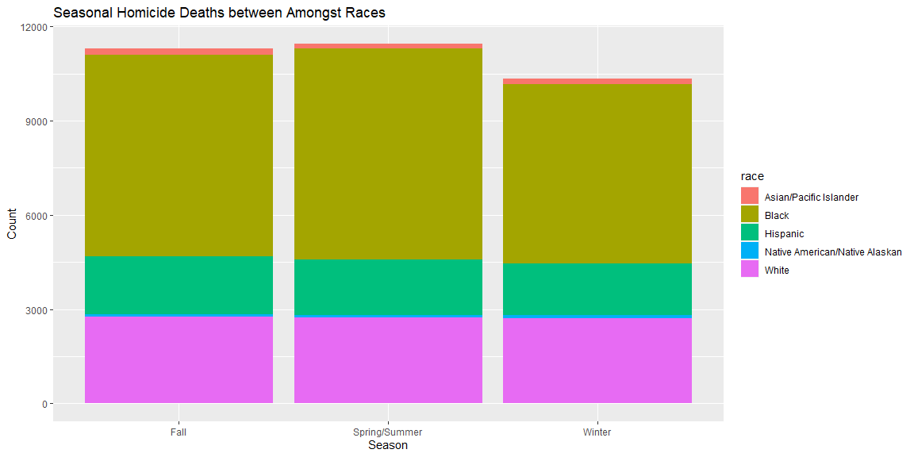
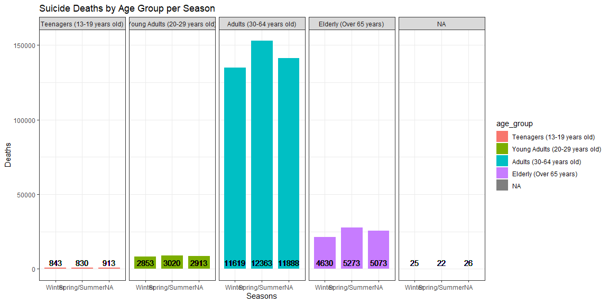

```r
# Use this R-Chunk to import all your datasets!
guns <- read_csv("https://raw.githubusercontent.com/fivethirtyeight/guns-data/master/full_data.csv")
```

## Background

_Place Task Background Here_

## Data Wrangling


```r
# Use this R-Chunk to clean & wrangle your data!
#remove columns
guns <- guns[,-c(5,9)] %>% 
  na.omit()


deaths <- guns %>% 
  mutate(season = case_when(as.numeric(month) %in% c(12,1,2,3)~'Winter', 
                            as.numeric(month) %in% c(4,5,6,7)~'Spring/Summer', 
                            as.numeric(month) %in% c(8,9,10,11)~'Fall')) %>% 
  mutate(age_group = case_when(age %in% c(9:12)~"Adolescence(9-12 years old)", 
                               age %in% c(13:19)~"Teenagers (13-19 years old)",
                               age %in% c(20:29)~"Young Adults (20-29 years old)",
                               age %in% c(30:64)~"Adults (30-64 years old)",
                               age %in% c(65:120)~"Elderly (Over 65 years)")) %>% 
  na.omit()
```

## Data Visualization


```r
# Use this R-Chunk to plot & visualize your data!
g <- guns %>%  
  group_by(intent, sex) %>% 
  mutate(Count = n()) %>% 
  ggplot(mapping = aes(x = intent, y = Count, fill = sex)) +
  geom_col(position = "dodge")  +
  geom_text(aes(label = Count),position = position_dodge(width = 1),
            vjust = -0.5, size = 4) +
  theme_bw() +
  labs(title = "Reasons for deaths", x = "Intent")
g 
```

<!-- -->

```r
deaths %>% 
  count(intent = factor(intent), sex = factor(sex)) %>% 
  mutate(pct = prop.table(n)) %>% 
  ggplot(aes(x = intent, y = pct, fill = sex, label = scales::percent(pct))) + 
  geom_col(position = 'dodge') + 
  geom_text(position = position_dodge(width = .9),    # move to center of bars
            vjust = -0.5,    # nudge above top of bar
            size = 3) + 
  scale_y_continuous(labels = scales::percent) +
   labs(title = "Deaths between Genders", x = "Intent", y= "Percentages")
```

<!-- -->


```r
f <- deaths %>%  
  ggplot(aes(x = intent)) +
 geom_bar(aes(fill = sex)) +
  labs(title = "Deaths between Genders", x = "Intent", y= "Count")
  
f
```

<!-- -->


```r
#for sure
deaths %>% filter(intent == "Suicide") %>% 
  ggplot(aes(x = season,fill = race)) +
  geom_bar() +
  labs(title = "Seasonal Suicidal Deaths between Amongst Races", x = "Season", y= "Count")
```

<!-- -->

```r
#for sure
deaths %>% filter(intent == "Homicide") %>% 
  ggplot(aes(x = season,fill = race)) +
  geom_bar() +
  labs(title = "Seasonal Homicide Deaths between Amongst Races", x = "Season", y= "Count") 
```

<!-- -->


```r
# arranges the columns in the order I want
deaths$season <- factor(deaths$season, levels = c('Winter','Spring/Summer','FALL'))
deaths$age_group <- factor(deaths$age_group, levels = c("Adolescence (9-12 years old)",
                                                        "Teenagers (13-19 years old)",
                                                        "Young Adults (20-29 years old)",
                                                        "Adults (30-64 years old)",
                                                        "Elderly (Over 65 years)"))

deaths %>% filter(intent == "Suicide") %>% 
  group_by(age_group, season) %>% 
  mutate(Count = n()) %>%
  ggplot(mapping = aes(x = season,y = Count/1000, fill = age_group)) +
  geom_col(width = .8) +
  facet_grid(.~age_group) +
  theme_bw() +
  labs(title = "Suicide Deaths by Age Group per Season", x = "Seasons", y = "Deaths") +
  geom_text(aes(label = Count),position = position_dodge(width = 1),
            vjust = -0.5, size = 4)
```

<!-- -->


## Conclusions
