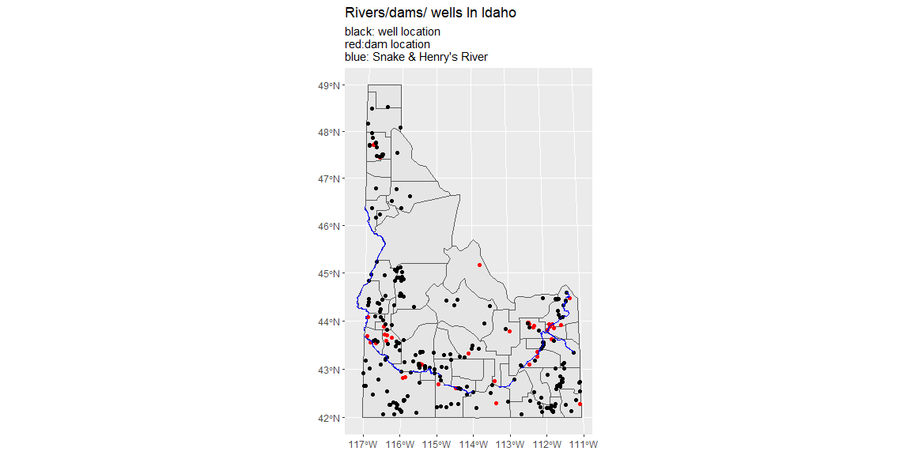

```r
# Use this R-Chunk to import all your datasets!
read_zip <- function(path_to_file) {
  
  df <- tempfile() # creates a tempfile but it doesn't have anything in it
  uf <- tempfile()
  download(path_to_file, df, mode = "wb") #stores a new file to the tempfile
  unzip(df, exdir = uf) # unzips the file I just stored to tempfile, and I'm going to extract it to location: uf
  mydata <- read_sf(uf) # stores uf in rivers
  class(rivers) # and now I can look at my enviornment to see what'ts inside my dataset
  file_delete(df); dir_delete(uf)
  mydata
}

rivers <- read_zip("https://research.idwr.idaho.gov/gis/Spatial/Hydrography/streams_lakes/c_250k/hyd250.zip")

us_shape <- read_zip("https://byuistats.github.io/M335/data/shp.zip")
wells <- read_zip("https://opendata.arcgis.com/datasets/1abb666937894ae4a87afe9655d2ff83_1.zip")
dams <- read_zip("https://opendata.arcgis.com/datasets/e163d7da3b84410ab94700a92b7735ce_0.zip")
```

## Background

We have been asked by the state of Idaho to visualize permitted well locations with a production of more than 5000 gallons and the spatial relationship of the large wells to the locations of large dams (surface area larger than 50 acres). They have provided a a shp file (Links to an external site.) for us and given us a web address for the well (Links to an external site.), dam (Links to an external site.), and water (Links to an external site.) locations. They would like to have the Snake River and Henrys Fork rivers plotted.

Their US map is projected to show the entire US. You will need to subset the data to Idaho and then reproject the map, so Idaho is not tilted.

## Data Wrangling


```r
# Use this R-Chunk to clean & wrangle your data!

idaho_shape <- us_shape %>% 
  filter(StateName == "Idaho")

wells_fifty <- wells %>% 
  filter(Production >= 5000)

 surface_area <- dams %>% 
   filter(SurfaceAre >= 50)

 river_hs <- rivers %>% 
   filter(FEAT_NAME %in% c("Snake River", "Henrys Fork"))
```

## Data Visualization


```r
# Use this R-Chunk to plot & visualize your data!
my_proj <- "+proj=moll +lat_0=45 +lon_0=-115 +lat_0=45 + x_0=0 +y_0=0 +ellps=WGS84 +datum=WGS84 +units=m +no_defs"


ggplot() + geom_sf(data = idaho_shape) + geom_sf(data = wells_fifty, color = "red") +geom_sf(data = surface_area) + 
  geom_sf(data =river_hs, color = "Blue") +
  coord_sf(crs = st_crs(my_proj)) +
   labs(title = "Rivers/dams/ wells In Idaho", subtitle = "black: well location\nred:dam location\nblue: Snake & Henry's River")
```

<!-- -->

## Conclusions


