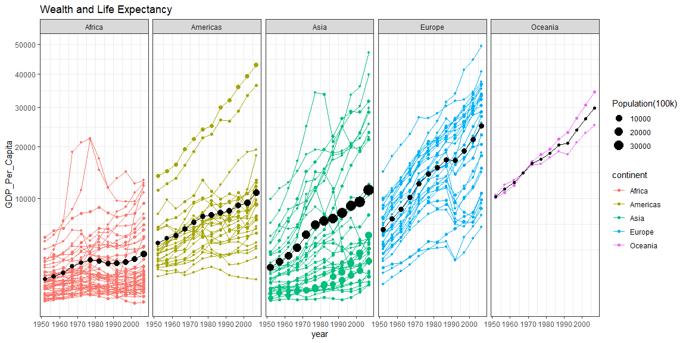

```r
gapa <- filter(gapminder, country != "Kuwait") %>% 
  mutate(pops = (pop/100000))
```

## Background

_Place Task Background Here_

## Data Wrangling


```r
# Use this R-Chunk to clean & wrangle your data!
wewe <- gapa %>% 
  group_by(continent, year) %>% 
  summarise(wewa = weighted.mean(gdpPercap),
            newpop = sum(pop/100000))
```

## Data Visualization


```r
# Use this R-Chunk to plot & visualize your data!
zaza <- ggplot(gapa,mapping =  aes(x=year,  y = gdpPercap, color = continent)) +
  geom_point(aes(size = pops)) +
  geom_line(aes(group = country)) +
  geom_point(data = wewe, aes(y=wewa, size = newpop), color = "black") + 
  geom_line(data = wewe, aes(y = wewa, x =year), color = "black") +
  labs(x= "year" , y = "GDP_Per_Capita", title = "Wealth and Life Expectancy", size = "Population(100k)") +
  scale_x_continuous(trans = "sqrt") +
  scale_y_continuous(trans = "sqrt") +
  theme_bw()

zizi <- zaza +
  facet_grid(.~continent)
zizi
```

<!-- -->

## Conclusions
