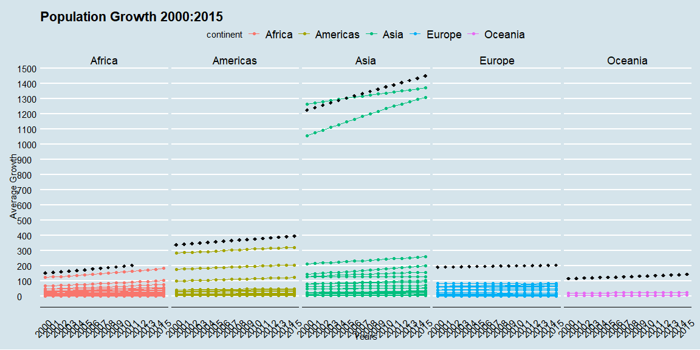
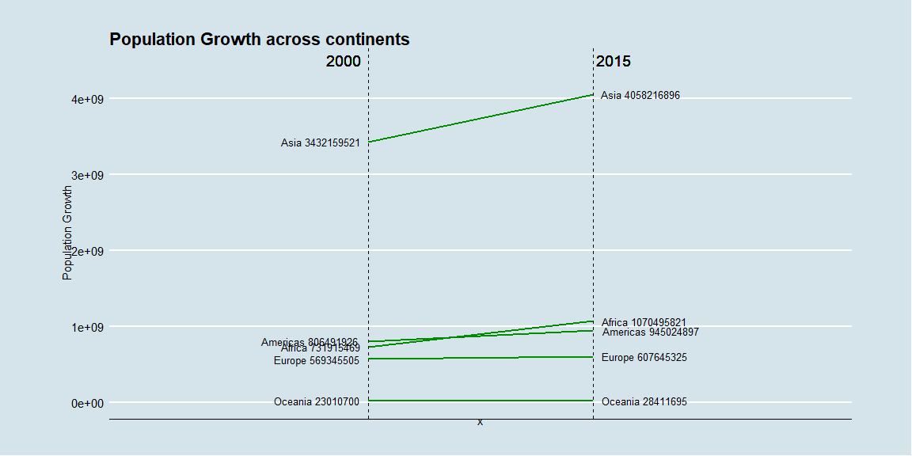
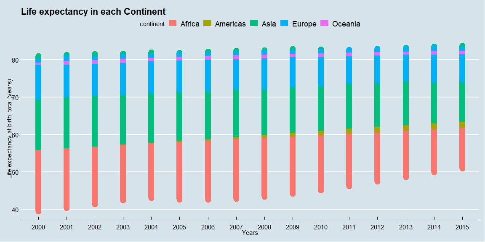
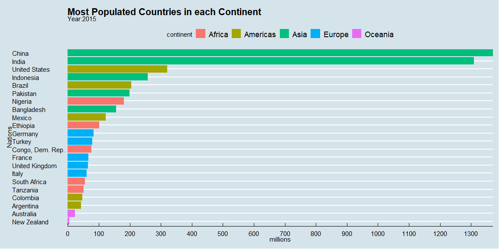
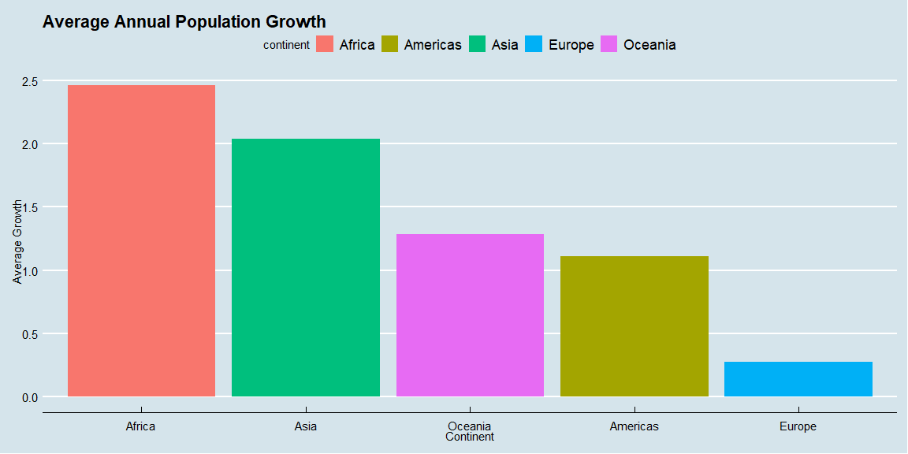
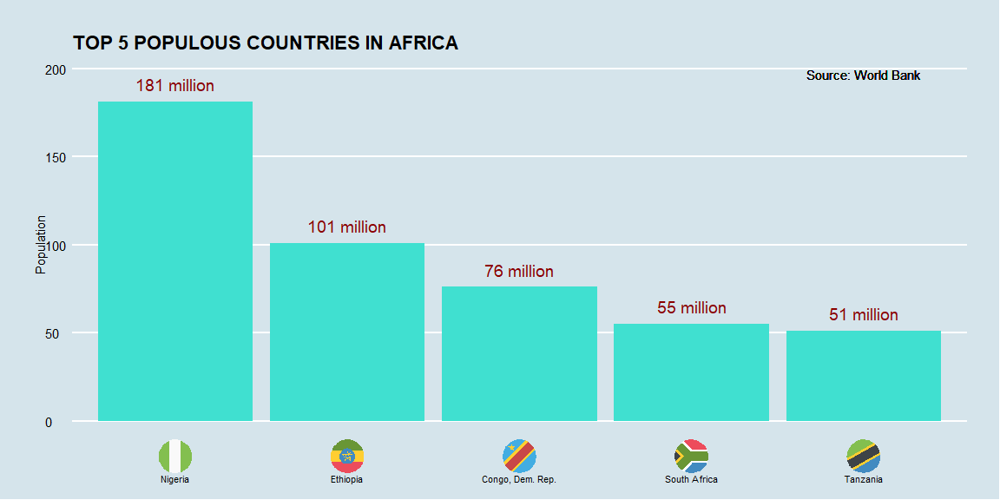
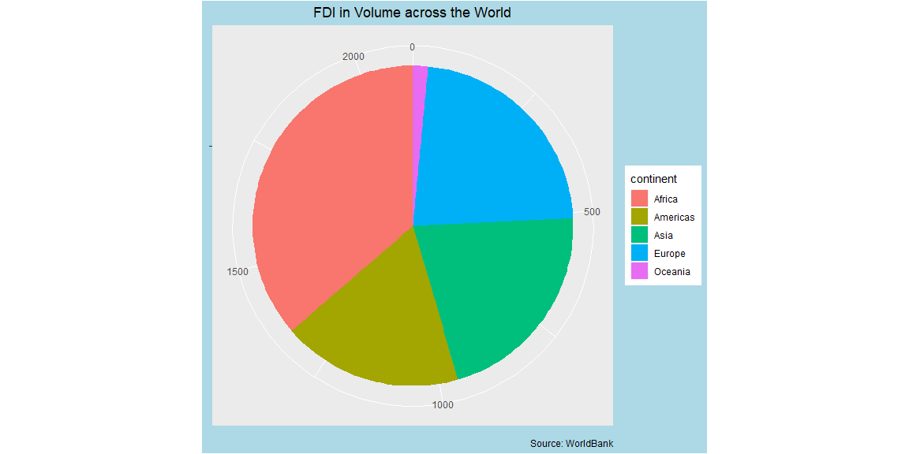

```r
# Use this R-Chunk to import all your datasets!
#pop <- read_csv("Wk_13_interactive_maps_with_leaflet/semester-project/pop.csv")
cody <- read_csv("https://datahub.io/core/country-list/r/data.csv")
pop <- read_csv("pop.csv")
```


## Background

There was an article I read before on population and it was published by the United Nation. It was titled ["Growing at slower rate"](https://www.un.org/development/desa/en/news/population/world-population-prospects-2019.html#:~:text=The%20world's%20population%20is%20expected,United%20Nations%20report%20launched%20today.) Morever, they anticipated that Africa's population will be increasing faster than any other continent.They have projected India to overtake China by 2027 as the world most populous country.

I have decided to do a little investigation to explore some previous trend on the world's population.I found a dataset provided by the [world bank](https://databank.worldbank.org/indicator/SP.POP.TOTL/1ff4a498/Popular-Indicators) which had different variables including population. The data was from the year 2000 to the year 2015.

## Data Wrangling


```r
# Use this R-Chunk to clean & wrangle your data!
worldpop <- pop %>% 
  subset(select = -c(`Series Code`,`Country Code`)) %>% 
  group_by(`Country Name`) %>% 
  filter(`Series Name` %in% c("Population, total",
                            "Population growth (annual %)",
                             "Poverty headcount ratio at national poverty lines (% of population)",
                             "Mortality rate, under-5 (per 1,000 live births)",
                             "GDP growth (annual %)",
                             "Net migration",
                             "Foreign direct investment, net inflows (BoP, current US$)",
                             "High-technology exports (% of manufactured exports)",
                             "Prevalence of HIV, total (% of population ages 15-49)",
                             "Fertility rate, total (births per woman)",
                             "Life expectancy at birth, total (years)"))


worldpops <- worldpop %>% 
  pivot_longer(cols = `2000 [YR2000]`:`2015 [YR2015]`,
              values_to = "Value",
               names_to = "Years") %>% 
  mutate(Value = case_when(Value == ".." ~ as.numeric(NA), TRUE ~ as.numeric(Value)))
 

wide <- worldpops %>%
  pivot_wider(id_cols = c(`Country Name`,Years),
              names_from = `Series Name`,
              values_from = Value,
              values_fill = list(Value = NA))

joined <- wide %>% 
  left_join(gapminder, by = c("Country Name" = "country")) %>% 
  separate(Years, c("2000" , "[YR2000]")) %>% 
  select(-c(year,lifeExp,pop,gdpPercap, "[YR2000]")) %>% 
  rename(Years = `2000`)

joined2 <- joined[!is.na(joined$continent), ] %>% 
  select(`Country Name`,continent, Years, everything()) %>% 
  distinct(Years,.keep_all = TRUE)


tops <- joined2 %>% 
  mutate(country2 = case_when(`Country Name` == "Congo, Dem. Rep." ~ "Congo, the Democratic Republic of the",
                              `Country Name` == "Tanzania"  ~ "Tanzania, United Republic of",
                              TRUE~`Country Name`)) %>% 
  left_join(cody, by = c("country2" = "Name")) %>% 
  group_by(continent) %>% 
  arrange(desc(`Population, total`),.by_group = TRUE) %>% 
  select(`Country Name`,Code,`Population, total`) %>%
  mutate(Code = tolower(Code)) %>% 
  distinct(`Country Name`,.keep_all = TRUE) %>% 
  slice_head(n = 5)


topsa <- tops %>% 
  filter(continent == "Africa") %>% 
  mutate(count = round(`Population, total`/1000000, 0)) %>% 
  mutate(label = paste(count, "million"))

topw <- tops %>% 
  mutate(count = round(`Population, total`/1000000, 0)) %>% 
  mutate(label = paste(count, "million"))

wewe <- joined2 %>% 
  group_by(continent, Years) %>% 
  summarise(wght = weighted.mean(`Population, total`/100000))


popo <- joined2 %>% 
  group_by(continent, Years) %>% 
  select(`Population, total`, continent, Years) %>% 
  filter(Years %in% c(2000,2015)) %>% 
  summarise(Overalpop = sum(`Population, total`, na.rm = TRUE))

widerr <- popo %>% 
  pivot_wider(id_cols = continent, 
              names_from = Years,
              values_from = Overalpop)

  
widerr$class <- ifelse((widerr$`2015` - widerr$`2000`) < 0, "red", "green")
left_label <- paste(widerr$continent, round(widerr$`2000`,0))
right_label <- paste(widerr$continent, round(widerr$`2015`,0))

f <- ggplot(widerr) + geom_segment(aes(x=1, xend=2, y=`2000`, yend=`2015`, col= class), size=1, show.legend=F) + 
  labs(title = "Population Growth across continents") +
  geom_vline(xintercept=1, linetype="dashed", size=.1) + 
  geom_vline(xintercept=2, linetype="dashed", size=.1) +
  scale_color_manual(labels = c("Up", "Down"), 
                     values = c("green"="green4", "red"="red")) +  # color of lines
  labs(y= "Population Growth") +  # Axis labels
  xlim(0, 3) + ylim(0,(1.1*(max(widerr$`2000`, widerr$`2015`))))

a <- joined2 %>% 
  group_by(continent) %>% 
  filter(!is.na(`Population growth (annual %)`)) %>% 
  summarise(avg = mean(`Population growth (annual %)`))
```

## Data Visualization
This plot shows the general growth trend of all the countries in each continent. I did find the average of each continent(shown in black) to see how the its performing. Europe seem to be moving at a very slower rate, whereas the rest, there has been some significant change. If we pay a close attention to Asia, the two line graphs are China and India. We can observe that India is closing down on the gap and 2027 prediction could turn out to be true. 


```r
ggplot(joined2,mapping =  aes(x = Years, y =`Population, total`/1000000, color = continent, group = continent)) + 
  geom_point() + 
  geom_line(aes(group = `Country Name`)) +
  geom_point(data = wewe, aes(y=wght), color = "grey4",size =2, shape =18) +
  scale_y_continuous(breaks = seq(0, 7000, by = 100)) +
  labs(title = "Population Growth 2000:2015",
       y = "Average Growth") +
  theme_economist() +
  theme(axis.ticks.x = element_blank(),
  axis.text.x = element_text(angle = 45) ) +
  facet_grid(.~continent)
```

<!-- -->

However, see the total numbers would give us a clearer picture of where we where before and where are now. This plot shows the number that all continents are experiencing an increase in population with Europe evidently experiencing the least growth rate.


```r
# f + geom_text(label=left_label, y=widerr$`2000`, x=rep(1, NROW(widerr)), hjust=1.1, size=3.5) +
#   geom_text(label=right_label, y=widerr$`2015`, x=rep(2, NROW(widerr)), hjust=-0.1, size=3.5) +
#   geom_text(label="2000", x=1, y=1.11*(max(widerr$`2000`, widerr$`2015`)), hjust=1.2, size=5)+
#   geom_text(label="2015", x=2, y=1.11*(max(widerr$`2000`, widerr$`2015`)), hjust=-0.1, size=5) 

f <- f + geom_text(label=left_label, y=widerr$`2000`, x=rep(1, NROW(widerr)), hjust=1.1, size=3.5)
f <- f + geom_text(label=right_label, y=widerr$`2015`, x=rep(2, NROW(widerr)), hjust=-0.1, size=3.5)
f <- f + geom_text(label="2000", x=1, y=1.11*(max(widerr$`2000`, widerr$`2015`)), hjust=1.2, size=5)  # title
f <- f + geom_text(label="2015", x=2, y=1.11*(max(widerr$`2000`, widerr$`2015`)), hjust=-0.1, size=5)


f +
  theme_economist() +
  theme(panel.background = element_blank(),
        #panel.grid = element_blank(),
        axis.ticks = element_blank(),
        axis.text.x = element_blank(),
        panel.border = element_blank(),
        plot.margin = unit(c(1,2,1,2), "cm"))
```

<!-- -->


Africa is known to be a continent with most birth rate with an average of [4.1](https://www.worldatlas.com/articles/continents-of-the-world-by-total-fertility-rates.html#:~:text=Africa%20%2D%204.1,the%20continents%20of%20the%20world.) children per woman compared to the rest of the world. Since many experts have predicted that Africa will grow and continue to grow, then why is that the population growth is not increasing at constant-faster rate.This plot answers that questions. Africa has had the lowest life expectancy rest. If more people are dying than they are being born, then the growth becomes insignificant. India's health system is very good, hence sustaining the rapid growth rate.


```r
ggplot(joined2, mapping =  aes(x = Years, y =`Life expectancy at birth, total (years)`, color = continent)) +
  labs( title = "Life expectancy in each Continent") +
  geom_line(size = 5) + theme_economist()
```

<!-- -->


### Most Populous countries in the world by 2015


```r
# Use this R-Chunk to plot & visualize your data!

topw %>% ggplot(aes(x = reorder(`Country Name`, count), y = `Population, total`/1000000, fill = continent)) +
  geom_col() +
  scale_y_continuous(breaks = seq(0, 2000, by = 100),  expand = c(0,0)) +
  labs(x = "Nations", y = "millions",
       title = "Most Populated Countries in each Continent",
       subtitle = "Year:2015") +
  theme(axis.text.x = element_text(angle = 45, vjust = 0.5, hjust = 1)) +
  theme(plot.title = element_text(hjust = 0.5)) +
  theme(legend.position = "continent") +
  coord_flip() +
  theme_economist()
```

<!-- -->


## A bit on Africa

It has the highest annual population growth rate followed by Asia.


```r
ggplot(a, aes(x = reorder(continent, -avg), y = avg, fill = continent)) + geom_col() +
  labs(title = "Average Annual Population Growth",
       y = "Average Growth",
       x = "Continent")+
  theme_economist()
```

<!-- -->

### The top 5 most populated African countires


```r
topsa %>% mutate(country = reorder(`Country Name`, -count)) %>% 
  ggplot(aes(country, count, label = label)) +
  geom_bar(stat = "identity", fill = "turquoise") +
  geom_text(nudge_y = 10, color = "darkred", size = 5) +
  geom_flag(y = -20, aes(country = Code), size = 12) +
  scale_y_continuous(breaks = c(0, 50, 100, 150, 200), limits = c(0,200)) +   
  geom_text(aes(5, 197, label = "Source: World Bank")) + 
  ggtitle(toupper("Top 5 populous countries in Africa")) + 
  xlab("") + 
  ylab("Population") +
  ggthemes::theme_economist() +
  theme(axis.text.x = element_text(size = 8, vjust = -16),
        axis.ticks.x = element_blank(),
        axis.line.x = element_blank(),
        plot.margin = unit(c(1,1,1,1), "cm"))
```

<!-- -->


### The continent that is experiencing most of the  foreign direct investment. 

Apparently is it Africa has lost of foreign investment which is a good thing. As more investors come and settle in Africa, they would eventually seek better health care systems which could stimulate the improvement of health care. As they continue to invest, the government is able to raise revenue through taxation. The revenue can be used to improve the health care facilities.


```r
pie <- ggplot(joined2, aes(x = "", fill = factor(continent))) + 
  geom_bar(width = 1) +
  theme(axis.line = element_blank(), 
        plot.title = element_text(hjust=0.5)) + 
  labs(title="FDI in Volume across the World", 
       x= NULL,
       y = NULL,
       fill="continent",
       caption="Source: WorldBank")

pie + coord_polar(theta = "y", start=0)+ 
  theme(plot.background = element_rect(fill = 'lightblue'))
```

<!-- -->


## Conclusions

The world is growing at a slower rate. We need not worry about becoming overpopulated or running out of resources as of yet. Other factors that can be looked into are birth and death rates across the world and migration. Hope you find this helpful and inciteful.


